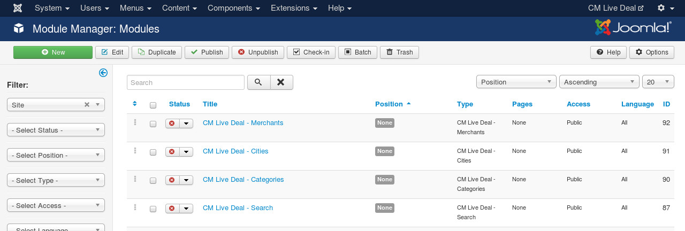
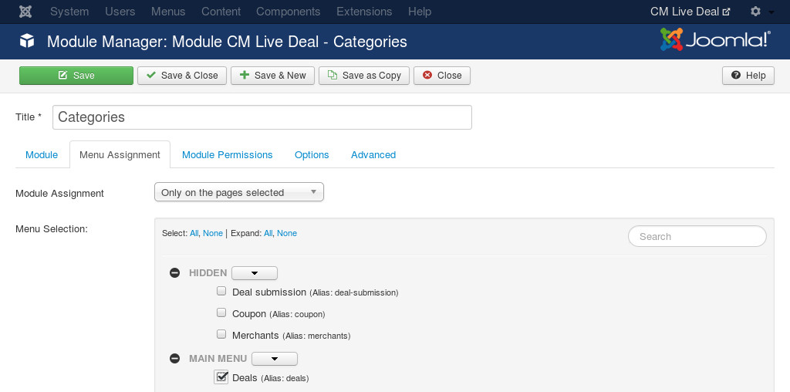

.. _ref-mod_cmlivedeal_categories:

==============================
CM Live Deal Categories module
==============================

CM Live Deal Categories module is used to display a list of all published categories.

To configure the module, you go to Extensions -> Module Manager.

.. image:: ../images/module_menu.jpg

Joomla! creates a new module for you automatically after you install the package of CM Live Deal. You can see CM Live Deal - Categories module in your module list.

Click on the module name to edit its settings. You can give the module a new name by modifying "Title" field. In the "Module" tab, you set "Status" to "Published" and select the position you want to put this module in "Position" option.

.. image:: ../images/mod_cmlivedeal_categories_tab_module.jpg

In "Menu Assignment" tab, you configure what pages the module is displayed on.

In "Options" tab, you can configure the main settings of the module.

* **Show deal quantity**: Show the number of deals in category.
* **<ul> CSS class**: CSS classes that are applied to <ul> HTML element.
* **<li> CSS class**: CSS classes that are applied to <li> HTML element.
* **Deal quantity CSS class**: CSS classes that are applied to deal quantity.
* **<ul> CSS style**: CSS styles that are applied to <ul> HTML element.
* **<li> CSS style**: CSS styles that are applied to <li> HTML element.
* **Deal quantity CSS style**: CSS styles that are applied to deal quantity.

CSS fields are useful if you want to customize the elements to match your template's style. This requires your skills in HTML and CSS.

For example, you can use the CSS classes from Bootstrap 2 like the screenshot above. The result could look like the screenshot below.

After adjusting the settings, you can save the module and then you will receive "Module successfully saved" message. If you change the module's name, you can see its name is updated in the module list.

You can check on your front-end to see if the module is displayed properly.

