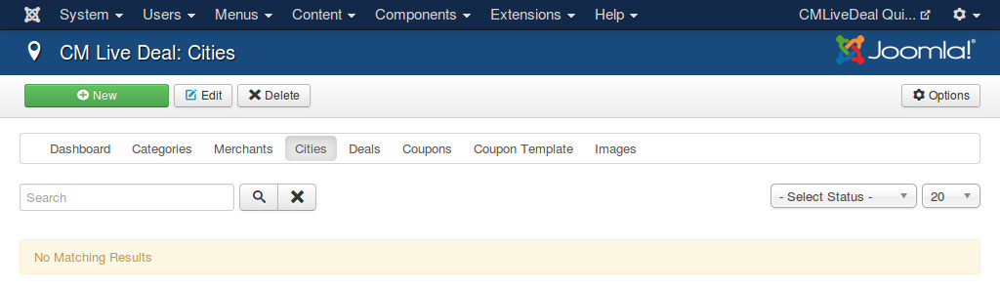
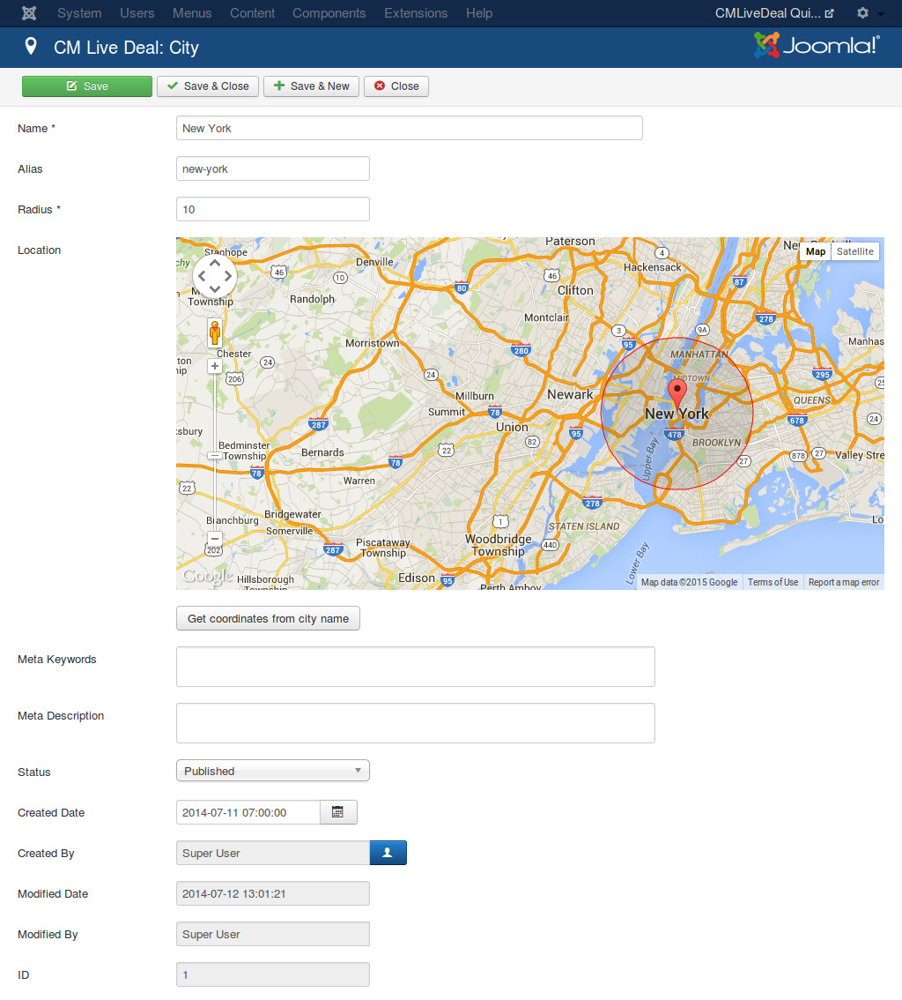
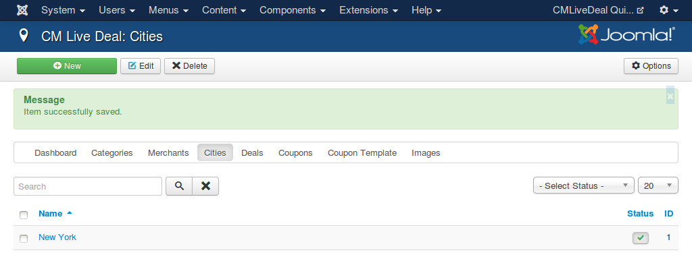

======
Cities
======

In your back-end, go to Components -> CM Live Deal to access CM Live Deal component.

.. image:: ../images/com_cmlivedeal_menu.jpg

On the toolbar, you click "Cities" item to access the list of cities.

.. image:: ../images/com_cmlivedeal_dashboard.jpg

Click "New" button on the toolbar to create a new city.

The form to create new city (and to edit existing city) has the following fields:

* **Name**: The city's name.
* **Radius**: The radius in kilometer to collect deals from the city's position. The deals which are in this radius are considered to belong to this city. After entering your value in this field, you can click somewhere else on the page to update the new value to the Google Maps on the page.
* **Location**: A Google Maps to select your city's location. You can move the marker to select the location. You can see an circle on the map, this circle's center is the Google Maps marker and the circle's radius is the radius of the "Radius" field, the deals which are in this circle are considered to belong to this city.
* **Status**: Status of the city.
* **Created Date**: The date the city is created.
* **Created by**: The person who creates the city.
* **Modified Date**: The date the city is modified the last time.
* **Modified by**: The person who does the last modification.
* **ID**: The ID of the city.

After saving the new city, it is displayed in your city list.

