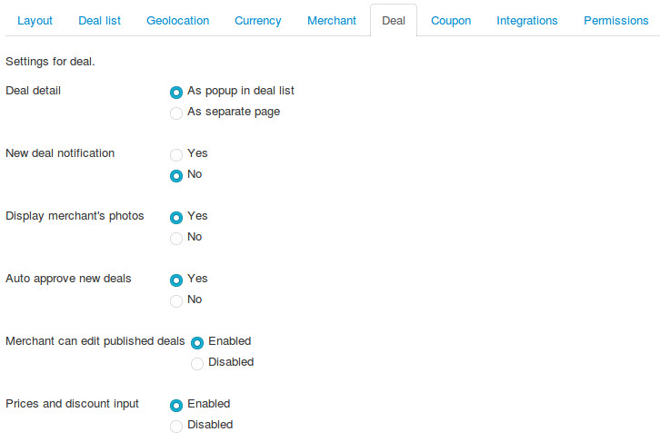
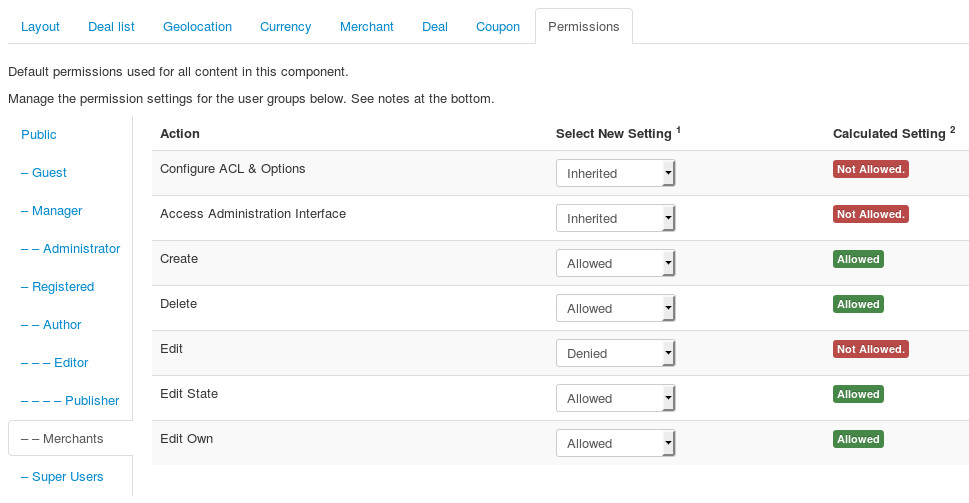
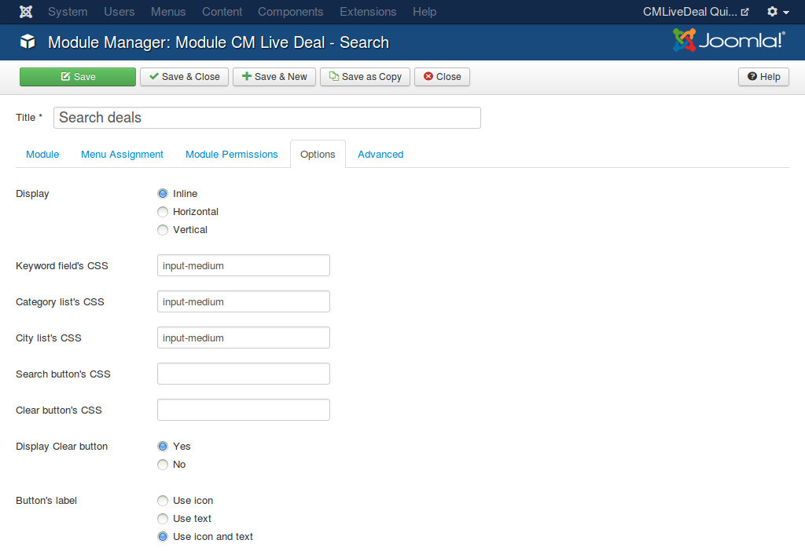
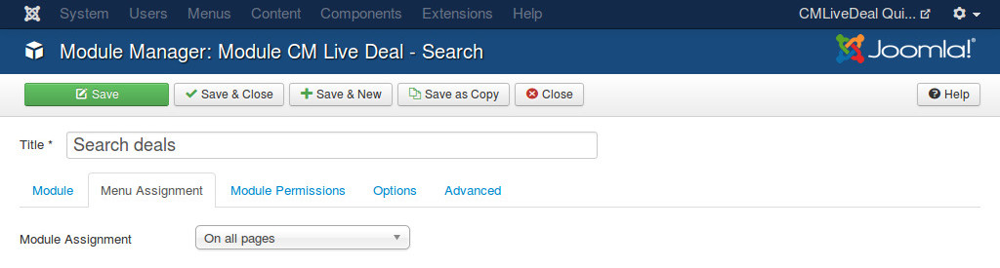
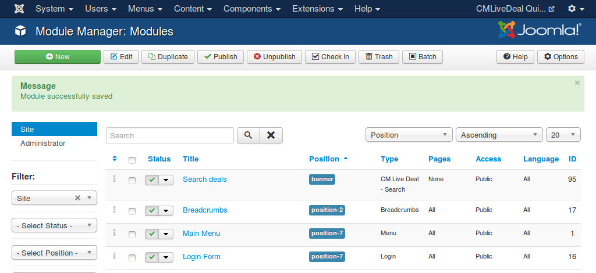
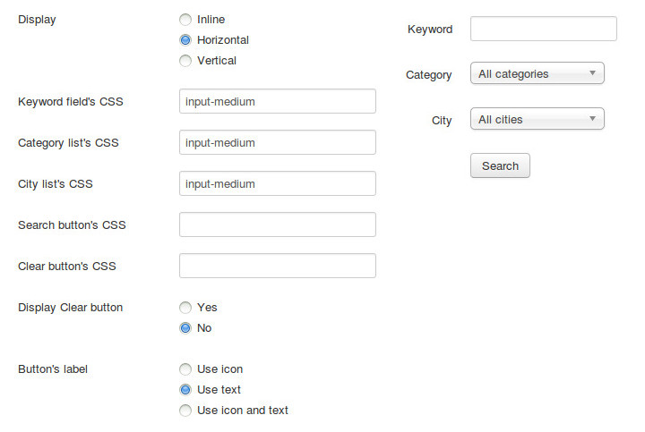
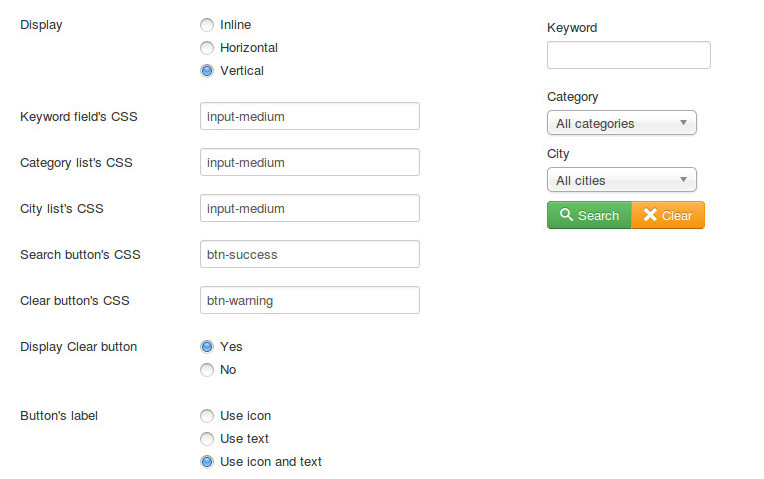

.. _ref-configuration:

=============
Configuration
=============

This section will give you instructions to setup Joomla! and CM Live Deal. If this is the first time you use CM Live Deal, we suggest that you should follow this guide step by step.

.. _ref-create-merchant-group:

Users component
---------------

The merchants in CM Live Deal component are actually Joomla! users that are in a specific user group.

In your back-end, you navigate to Users -> Groups.

.. image:: ../images/com_users_group_menu.jpg

You can see the list of current user groups on your site. Click "New" button in the toolbar to create a new user group.

You give your new user group a name by entering the name in "Group Title" field. You select a parent group in "Group Parent" option. Because merchant is just a registered user so you can select "Registered" as the parent group, you can always select a different group if you are already familiar with Jooma!'s user group and access level.

.. image:: ../images/com_users_group_new.jpg

After creating the user group, you can see it displayed in the group list as the screenshot below.

Media Manager component
-----------------------

Merchant can upload image to your site. You need to configure where the images are stored and what image extensions are allowed to upload.

In your back-end, you navigate to Content -> Media Manager to access Media Manager component.

You can see the page similar to the screenshot below.

.. image:: ../images/com_media_view.jpg

You click "Options" button on the toolbar to configure the component.

CM Live Deal uses the configuration of Media Manager in uploading merchant's photo. You can adjust the default settings of Media Manager to suit your needs. If you don't have any special requirement, you can keep the default settings.

In Media Manager's main view (Content -> Media Manager), you create a new folder to store all merchants's photos by clicking "Creat New Folder" button, enter the folder name and click "Create Folder" button.

.. image:: ../images/com_media_create.jpg

You will receive "Create Complete" message if the folder is created successfully.

CM Live Deal component
----------------------

In your back-end, go to Components -> CM Live Deal to access CM Live Deal component.

.. image:: ../images/com_cmlivedeal_menu.jpg

The dashboard is displayed by default.

.. image:: ../images/com_cmlivedeal_dashboard.jpg

On the toolbar there is a button "Options", you click this button to configure the component.

On the configuration page, the settings are grouped into 5 tabs: Layout, Merchant, Deal, Coupon and Permissions.

Layout
^^^^^^

.. image:: ../images/com_cmlivedeal_layout.jpg

* **Image's width (management)**: Image thumbnail's width (pixel) in deal list table (in back-end and in merchant's management area in front-end). Default value is 50px.
* **Map's height**: The height of Google's maps, used in both front-end and back-end. Default value is 400px.
* **Map's zoom level**: Default Google Maps's zoom level. Default value is 15.
* **Map's default location**: The default location of Google Maps when the map is displayed, used in both front-end and back-end. You can click on the map or move the marker to the location you want.
* **Date format**: Date format that is used in front-end.
* **Time format**: Time format that is used in front-end.

Merchant
^^^^^^^^

.. image:: ../images/com_cmlivedeal_merchant.jpg

* **Merchant's user group**: Joomla! user group that merchant are assigned to. Only users in the selected group can submit new deal and edit merchant's profile. You need to select the group that you create in the above step.
* **Add merchant to group**: Options for adding merchant to merchant's Joomla! user group after registration.

  * *Add automatically after registration*: After user registers for a merchant account, user is added to the merchant group automatically.
  * *Add manually by administrators*: After user registers for a merchant account, user is not added to the merchant group. Administrator needs to review user's registration and add user to the group manually.

* **Block merchant**: After user registers for a merchant account, user's Joomla! account is blocked and user can not login, administrator needs to unblock the account after reviewing the registration.
* **New merchant notification**: Send email to administrators when there is a new merchant registration.
* **Image folder**: Folder where the images that are uploaded by merchants are stored. You can only select the folders which are in the image folder that you set in Media Manager component. You can select the folder that you create in Media Manager in the above step of Media Manager.
* **Display user's stats**: Display coupon owner's statistics in merchant's coupon list. This info lets merchant know if coupon owner is a serious customer.
* **Display user's visits**: Display coupon owner's visits to merchant's. This info lets merchant know if coupon owner is a returned customer.

Deal
^^^^

* **New deal notification**: Send email to administrators when there is a new deal submitted.
* **Search radius from user's location**: The radius in kilometer to search for nearby deals of user. Default is 5 kilometers. This value is used when user searches for deals in his/her location by using the search module.
* **Location cookie's lifetime**: Detect user's location requires reading the database file and make the server slow. User's location can be stored in cookie and reused later to reduce the file reads from server. With this option you can set how many days this cookie is available. Default value is 7 (days). You can disable storing cookie by using 0 value. You can view :ref:`ref-search` for more information.

Coupon
^^^^^^

.. image:: ../images/com_cmlivedeal_coupon.jpg

* **Coupon code's length**: The number of characters in a coupon code. Default value is 5.
* **Coupon's characters**: The character's types in coupon code. Default is alphanumeric. Coupon code's characters are always uppercase.

  * *Latin alphabetic characters only (from A to Z)*: for example, "GWLCA".
  * *Latin numeric characters only (from 0 to 9)*: for example, "83061".
  * *Latin alphabetic and numeric*: for example, "F52H2".

Permissions
^^^^^^^^^^^

On the left side there are tabs for user groups. On the right side, we have the options of the permissions that the users in the selected group can do.

You select your merchant group and configure the following permissions:

* **Configure**: Denied
* **Access Administration Interface**: Denied
* **Create**: Allowed
* **Delete**: Allowed
* **Edit**: Denied
* **Edit State**: Allowed
* **Edit Own**: Allowed

.. _ref-merchant-registration-menu-item:

Menu item for merchant registration page
----------------------------------------

CMLD Merchant plugin has an option for merchant registration page, we need to have this page before setting up the plugin.

In your back-end, you navigate to Menus menu item and select a menu that you want to create the registration page. The below screenshots uses "Main Menu" menu.

.. image:: ../images/menu_registration_menu.jpg

After selecting the menu, you are taken to the list of current menu items in that menu.

.. image:: ../images/menu_registration_list.jpg

You click the "New" button on the toolbar to add a new menu item, then you are taken to the page as the screenshot below.

.. image:: ../images/menu_registration_create.jpg

You click the "Select" button of "Menu Item Type" field to select menu item's type, a popup will be displayed. You select "Registration Form" of "Users Manager" and the popup is closed.

.. image:: ../images/menu_registration_popup.jpg

You enter the name of this new menu item and then save.

This new menu item is now displayed in your menu item list.

CMLD Merchant plugin
-----------------------

CMLD Merchant (CM Live Deal - Merchant) is a Joomla! plugin to insert custom profile fields into Joomla! user profile. CMLD Merchant plugin provides the needed fields for merchant profile.

To configure the plugin, you need to access Extensions -> Plugin Manager.

You can search for the plugin by using keyword "merchant", "CM Live Deal", etc... The plugin name is "User - CM Live Deal's merchant profile"

You click on the plugin name to edit the plugin's setting.

* **Registration page**: You select the menu item of merchant registration page that you create in the above step.
* **Status**: You set the status to "Enabled".

For profile fields, you have 3 options:

* **Required**: Field is displayed and user must enter value.
* **Optional**: Field is displayed and user can leave field empty.
* **Disabled**: Field is not displayed in profile form.

After saving the plugin, you receive the message "Plugin successfully saved".

.. image:: ../images/plg_user_cmldmerchant_saved.jpg

You can visit the page for merchant registration in your front-end to check if the merchant's profile fields are displayed there. The page could look like the following screenshot.

.. image:: ../images/plg_user_cmldmerchant_frontend.jpg

.. _ref-mod_cmlivedeal_search:

CM Live Deal Search module
-----------------------------

To configure your Search module, you go to Extensions -> Module Manager.

.. image:: ../images/mod_cmlivedeal_search_menu.jpg

Joomla! creates a new module for you automatically after you install the package of CM Live Deal. You can see CM Live Deal - Search module in your module list.

.. image:: ../images/mod_cmlivedeal_search_list.jpg

Click on the module name to edit its settings. You can give the module a new name by modifying "Title" field. In the "Module" tab, you set "Status" to "Published" and select the position you want to put this module in "Position" option.

.. image:: ../images/mod_cmlivedeal_search_tab_module.jpg

In "Options" tab, you can configure the main settings of the module.

* **Display**: How search form is displayed, there are 3 styles, "Inline", "Horizontal", "Vertical". You can see how search form looks like in these styles in the screenshot below.
* **Keyword field's CSS**: Custom CSS classes for keyword input field.
* **Category list's CSS**: Custom CSS classes for category dropdown list.
* **City list's CSS**: Custom CSS classes for city dropdown list.
* **Search button's CSS**: Custom CSS classes for search button.
* **Clear button's CSS**: Custom CSS classes for clear button.
* **Display Clear button**: Display or hide clear button.
* **Button's label**:

  * *Use icon*: Use only icons for search and clear buttons.
  * *Use text*: Use only text for search and clear buttons.
  * *Use icon and text*: Use both icon and text for search and clear buttons.

CSS fields are useful if you want to customize the element of search form to match your template's style. This requires your skills in HTML and CSS.

In "Menu Assignment" tab, you configure what pages the module is displayed on.

After adjusting the settings, you can save the module and then you will receive "Module successfully saved" message. If you change the module's name, you can see its name is updated in the module list.

You can check on your front-end to see if the module is displayed properly. The below screenshot is how the inline search form is displayed in "banner" positon of Joomla!'s' default Protostar template.

.. image:: ../images/mod_cmlivedeal_search_frontend.jpg

**Examples** (the settings on the left side, the result on the right side)

Example of how inline search form is displayed. The Clear button is displayed and the buttons have only icons. The fields are customized by using "input-medium" class of Bootstrap.

.. image:: ../images/mod_cmlivedeal_search_inline.jpg

Example of how horizontal search form is displayed. The Clear button is not displayed and the Search button has only text. The fields are customized by using "input-medium" class of Bootstrap.

Example of how vertical search form is displayed. The Clear button is displayed and is customized by "btn-warning" class of Boostrap. The Search button is customized by "btn-success" class of Bootstrap. Icon and text are both used in the buttons. The fields are customized by using "input-medium" class of Bootstrap.

