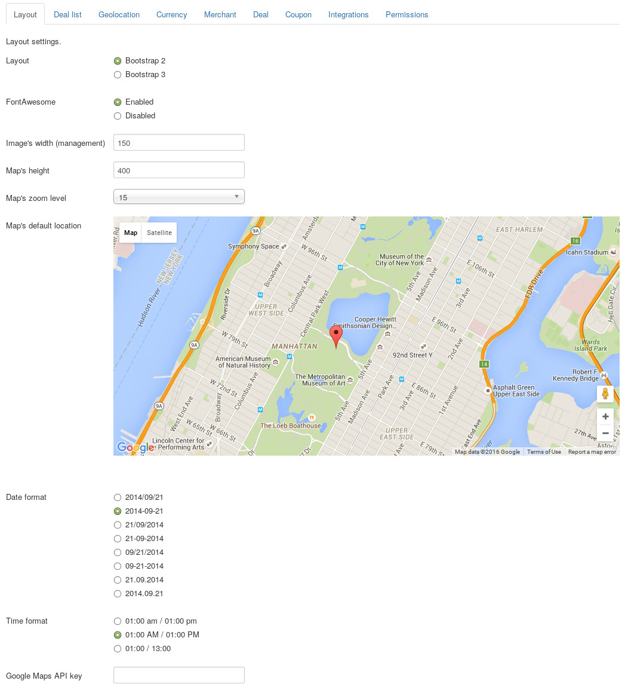
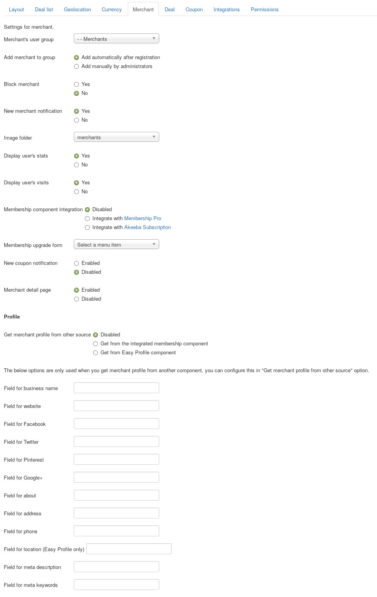

.. _ref-configuration:

=============
Configuration
=============

This section will give you instructions to setup Joomla! and CM Live Deal. If this is the first time you use CM Live Deal, we suggest that you should follow this guide step by step.

.. _ref-create-merchant-group:

Users component
---------------

The merchants in CM Live Deal component are actually Joomla! users that are in a specific user group.

In your back-end, you navigate to Users -> Groups.

You can see the list of current user groups on your site. Click "New" button in the toolbar to create a new user group.

.. image:: ../images/com_users_group_list.jpg

You give your new user group a name by entering the name in "Group Title" field. You select a parent group in "Group Parent" option. Because merchant is just a registered user so you can select "Registered" as the parent group, you can always select a different group if you are already familiar with Jooma!'s user group and access level.

After creating the user group, you can see it displayed in the group list as the screenshot below.

.. image:: ../images/com_users_group_list_saved.jpg

Media Manager component
-----------------------

Merchant can upload image to your site. You need to configure where the images are stored and what image extensions are allowed to upload.

In your back-end, you navigate to Content -> Media Manager to access Media Manager component.

.. image:: ../images/com_media_menu.jpg

You can see the page similar to the screenshot below.

.. image:: ../images/com_media_view.jpg

You click "Options" button on the toolbar to configure the component.

.. image:: ../images/com_media_options.jpg

CM Live Deal uses the configuration of Media Manager in uploading merchant's photo. You can adjust the default settings of Media Manager to suit your needs. If you don't have any special requirement, you can keep the default settings.

In Media Manager's main view (Content -> Media Manager), you create a new folder to store all merchants's photos by clicking "Creat New Folder" button, enter the folder name and click "Create Folder" button.

You will receive "Create Complete" message if the folder is created successfully.

.. image:: ../images/com_media_success.jpg

CM Live Deal component
----------------------

In your back-end, go to Components -> CM Live Deal to access CM Live Deal component.

.. image:: ../images/com_cmlivedeal_menu.jpg

The dashboard is displayed by default.

.. image:: ../images/com_cmlivedeal_dashboard.jpg

On the toolbar there is a button "Options", you click this button to configure the component.

On the configuration page, the settings are grouped into 8 tabs: Layout, Deal list, Currency Merchant, Deal, Coupon, Integrations and Permissions.

Layout
^^^^^^

* **Layout**: The Bootstrap version which CMLiveDeal uses. Select the Bootstrap version which your template supports.
* **FontAwesome**: CMLiveDeal needs FontAwesome for icons. If your template or other extensions (like plugins) already loads FontAwesome then you should set this option to "Disabled" to not load FontAwesome from CMLiveDeal.
* **Image's width (management)**: Image thumbnail's width (pixel) in deal list table (in back-end and in merchant's management area in front-end). Default value is 50px.
* **Map's height**: The height of Google's maps, used in both front-end and back-end. Default value is 400px.
* **Map's zoom level**: Default Google Maps's zoom level. Default value is 15.
* **Map's default location**: The default location of Google Maps when the map is displayed, used in both front-end and back-end. You can click on the map or move the marker to the location you want.
* **Date format**: Date format that is used in front-end.
* **Time format**: Time format that is used in front-end.
* **Google Maps API key**: If Google requires an API key to use Google Maps, you create a **Browser key** and enter it here. You can find more info about getting an API key `here <https://developers.google.com/maps/documentation/javascript/get-api-key>`_.

Deal list
^^^^^^^^^

* **Deal list's column quantity**: The number of columns in deal list.
* **Thumbnail width**: The width of deal image in deal list calculated by Bootsrap framework's 12 grid column. You can select one of the 3 options and refresh your front-end deal list until it looks good for you. This option is only used if you only have 1 column in your deal list.
* **Default pagination limit**: The quantity of deals that are displayed in deal list by default.
* **Show pagination limit option**: Show an option to select the quantity of deals that are displayed in 1 page in deal list.
* **Show pagination sorting option**: Show an option to select how deals in deal list are sorted.
* **Show price tag**: Show price tag at the top left corner of every deal in deal list. This price tag contains discounted price, discounted value or discount percent.
* **Show original and discounted prices**: Show original price and discounted price of deal of it has these prices.
* **Price tag of deals which have discounted price**: If deal has original price and discounted price, you show discounted price or discount value (how much customers save). For example, if orginal price is $100, discounted price is $40, you can show $40 (discounted price) or $60 (discount value).
* **Show featured deals first**: Show featured deals on the top of deal list.
* **Show ribbon for featured deals**: Show a ribbon on the top right corner of feature deals.

Geolocation
^^^^^^^^^^^

* **Geolocation service**: The service you use to detect user's location.

  * *Disabled*: Searching for deals which are near user's location is disabled.
  * *HTML5 Geolocation*: Use Geolocation which is available in HTML5 technology.
  * *Maxmind*: Use GeoLite2 data created by `MaxMind <http://www.maxmind.com>`_.

* **Search radius from user's location**: The radius in kilometer to search for nearby deals of user. Default is 5 kilometers. This value is used when user searches for deals in his/her location by using the search module.

Currency
^^^^^^^^

* **Currency symbol**: Currency symbol which is used for original price, discounted price and discounted value.
* **Currency symbol's position**: Where currency symbol is displayed, before or after amount.
* **Currency decimals**: The number of decimals in currency.
* **Decimal point**: The character which is used as decimal point.
* **Thousands separator**: The character which is used as thousands separator.

.. _ref-configuration-merchant:

Merchant
^^^^^^^^

* **Merchant's user group**: Joomla! user group that merchant are assigned to. Only users in the selected group can submit new deal and edit merchant's profile. You need to select the group that you create in the above step.
* **Add merchant to group**: Options for adding merchant to merchant's Joomla! user group after registration.

  * *Add automatically after registration*: After user registers for a merchant account, user is added to the merchant group automatically.
  * *Add manually by administrators*: After user registers for a merchant account, user is not added to the merchant group. Administrator needs to review user's registration and add user to the group manually.

* **Block merchant**: After user registers for a merchant account, user's Joomla! account is blocked and user can not login, administrator needs to unblock the account after reviewing the registration.
* **New merchant notification**: Send email to administrators when there is a new merchant registration.
* **Image folder**: Folder where the images that are uploaded by merchants are stored. You can only select the folders which are in the image folder that you set in Media Manager component. You can select the folder that you create in Media Manager in the above step of Media Manager.
* **Display user's stats**: Display coupon owner's statistics in merchant's coupon list. This info lets merchant know if coupon owner is a serious customer.
* **Display user's visits**: Display coupon owner's visits to merchant's. This info lets merchant know if coupon owner is a returned customer.
* **Membership component integration**: To enable membership integration, select a membership Joomla! component to integrate with. Membership Plans menu item will be available in the component's menu for you to create and configure your membership plans.
* **Membership upgrade form**: The menu item for upgrading membership. The link to this menu item is displayed in merchant's deal management page when merchant reaches his/her limit of created deal quantity. This option is only used if membership integration is enabled.
* **New coupon notification**: Send email to merchant when there is new coupon captured.
* **Merchant detail page**: Enable merchant detail page where merchant info and merchant's deal list are displayed.
* **Get merchant profile from other source**:

  * *Get from the integrated membership component*: Enable copying subscriber's profile from the membership component to CM Live Deal's merchant profile after merchant subscribes his/her membership, so merchant only enter his/her info once. Please see :ref:`ref-membership` section for more information.
  * *Get from Easy Profile component*: Merchant profile is retrieved from Easy Profile component directly. If you enable this, you don't need to use CM Live Deal's merchant profile plugin any more, merchant edit his profile in Easy Profile component.

If you get merchant profile from another component, you enter the aliases of the fields in that component into the fields at the bottom of the page.

Field for location is only supported for Easy Profile because in Easy Profile we can create a Google Maps field which we can use to select a location.

.. _ref-configuration-deal:

Deal
^^^^

.. image:: ../images/com_cmlivedeal_deal.jpg

* **Deal detail**: Enable/disable deal detail page.

  * As popup in deal list: Deal detail page is disabled. When you click a deal in deal list, a popup (modal) appears and displays deal's info. You can close the popup and view another deal without leaving the deal list.
  * As separate page: Deal detail page is enabled. When you click a deal in deal list, you are taken to another page.

* **New deal notification**: Send email to administrators when there is a new deal submitted.
* **Display merchant's photos**: Display the slideshow for merchant's photos in deal's popup.
* **Auto approve new deals**: If enabled, new deals that are submitted by merchants are approved and published by default. Enable this option if you don't want to manually check and approve/publish every submitted deal.
* **Merchant can edit published deals**: Allow merchants to edit their own deals after the deals are published and visible to customers.
* **Prices and discount input**: Enable options for original price, discounted price and fixed discount values of the deal in deal submission form.

Coupon
^^^^^^

.. image:: ../images/com_cmlivedeal_coupon.jpg

* **Coupon code's length**: The number of characters in a coupon code. Default value is 5.
* **Coupon's characters**: The character's types in coupon code. Default is alphanumeric. Coupon code's characters are always uppercase.

  * *Latin alphabetic characters only (from A to Z)*: for example, "GWLCA".
  * *Latin numeric characters only (from 0 to 9)*: for example, "83061".
  * *Latin alphabetic and numeric*: for example, "F52H2".

* **Coupon format**:

  * *HTML*: Coupon in HTML format (a web page).
  * *PDF*: Coupon in PDF format. You need to install mPDF library package. Please view :ref:`ref-pdfcoupon` section for more information.

* **QR code's size**: The size of coupon's QR code in pixel.
* **Guest can get coupon**: Allow guests can capture coupons without registering accounts.
* **Limit coupon quantity**: Enable this option to give administrators and merchants ability to set and change coupon quantity for every deal. If this option is disabled, coupon quantity is unlimited.
* **Limit 1 coupon per registered user**: Enable this option if you only allow a registered user to get 1 coupon for 1 deal. Disable this option if you want to allow registered users to get unlimited coupon for every deal.

Integrations
^^^^^^^^^^^^

* **Falang integration**: Enable this option if you use Falang.

Permissions
^^^^^^^^^^^

.. image:: ../images/com_cmlivedeal_permissions.jpg

On the left side there are tabs for user groups. On the right side, we have the options of the permissions that the users in the selected group can do.

You select your merchant group and configure the following permissions:

* **Configure ACL & Options**: Not Allowed
* **Access Administration Interface**: Not Allowed
* **Create**: Allowed
* **Delete**: Allowed
* **Edit**: Not Allowed
* **Edit State**: Allowed
* **Edit Own**: Allowed

.. _ref-merchant-registration-menu-item:

Menu item for merchant registration page
----------------------------------------

CMLD Merchant plugin has an option for merchant registration page, we need to have this page before setting up the plugin.

In your back-end, you navigate to Menus menu item and select a menu that you want to create the registration page. The below screenshots uses "Main Menu" menu.

After selecting the menu, you are taken to the list of current menu items in that menu.

You click the "New" button on the toolbar to add a new menu item, then you are taken to the page as the screenshot below.

You click the "Select" button of "Menu Item Type" field to select menu item's type, a popup will be displayed. You select "Registration Form" of "Users Manager" and the popup is closed.

You enter the name of this new menu item and then save.

.. image:: ../images/menu_registration_name.jpg

This new menu item is now displayed in your menu item list.

.. image:: ../images/menu_registration_list_saved.jpg

CMLD Merchant plugin
-----------------------

CMLD Merchant (CM Live Deal - Merchant) is a Joomla! plugin to insert custom profile fields into Joomla! user profile. CMLD Merchant plugin provides the needed fields for merchant profile.

To configure the plugin, you need to access Extensions -> Plugin Manager.

.. image:: ../images/plg_user_cmldmerchant_menu.jpg

You can search for the plugin by using keyword "merchant", "CM Live Deal", etc... The plugin name is "User - CM Live Deal's merchant profile"

.. image:: ../images/plg_user_cmldmerchant_list.jpg

You click on the plugin name to edit the plugin's setting.

.. image:: ../images/plg_user_cmldmerchant_form.jpg

* **Registration page**: You select the menu item of merchant registration page that you create in the above step.
* **Status**: You set the status to "Enabled".

For profile fields, you have 3 options:

* **Required**: Field is displayed and user must enter value.
* **Optional**: Field is displayed and user can leave field empty.
* **Disabled**: Field is not displayed in profile form.

After saving the plugin, you receive the message "Plugin successfully saved".

.. image:: ../images/plg_user_cmldmerchant_saved.jpg

You can visit the page for merchant registration in your front-end to check if the merchant's profile fields are displayed there. The page could look like the following screenshot.

