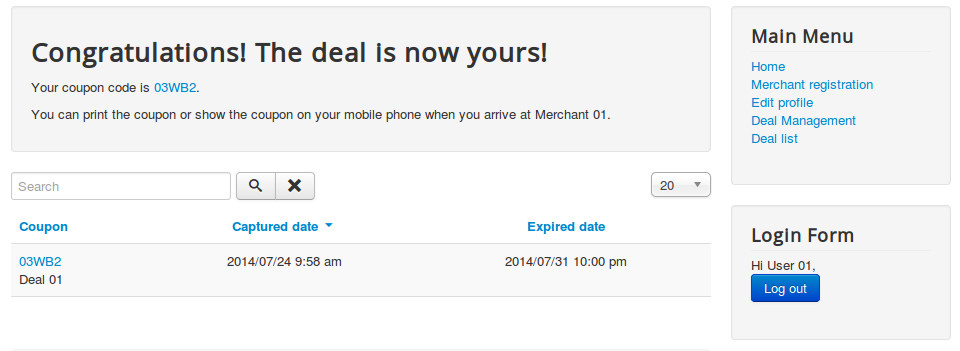
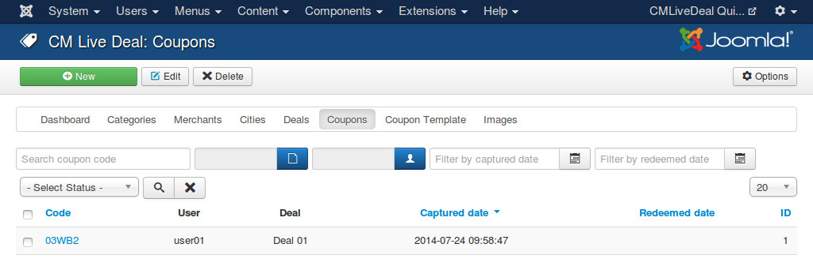
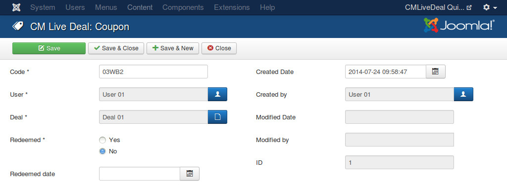
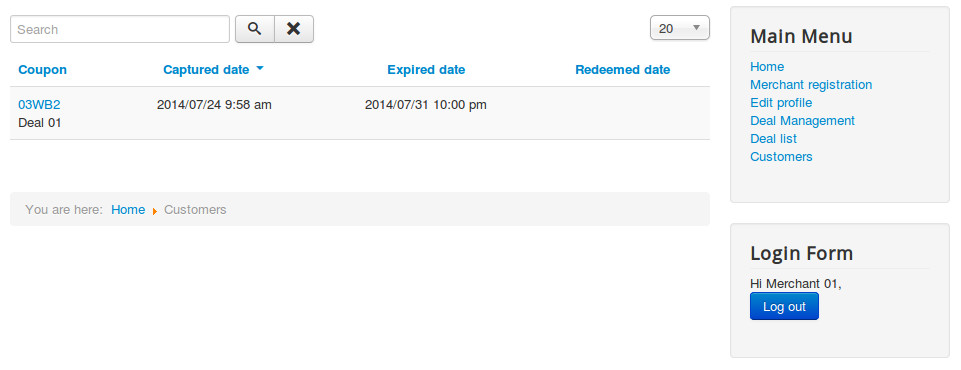
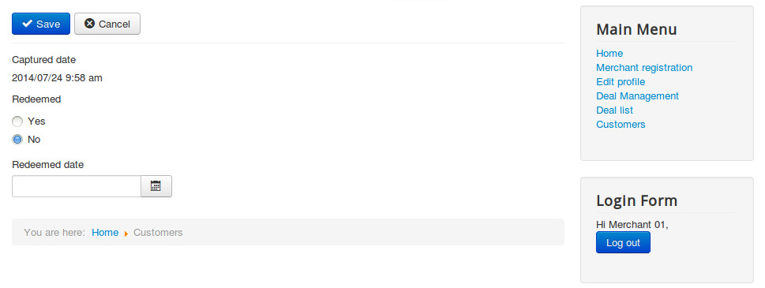

=======
Coupons
=======

User gets coupon
----------------

While browsing deal list, user can click on any deal that they are interested in. If user likes a deal and decides to try it, he/she can click "Get coupon" button capture a coupon of the deal. User must be log into the site first before getting a coupon.

"Get coupon" button is not available if the current user is a merchant and the deal is his/her deal.

"Get coupon" button is not clickable if user has already captured a coupon of the deal in the past.

After capturing a coupon, user is taken to the list of his/her coupons, on this page user can have the coupon code and can access the captured coupon to print it..

User's coupon list
------------------

You can create a menu item for "User's Coupons" to let users access their coupon list in front-end.

.. image:: ../images/deal_frontend_menu.jpg

Administratiors manage coupons
------------------------------

In your back-end, go to Components -> CM Live Deal to access CM Live Deal component.

.. image:: ../images/com_cmlivedeal_menu.jpg

On the toolbar, you click "Coupons" to access the list of coupons.

.. image:: ../images/com_cmlivedeal_dashboard.jpg

You can edit an existing coupon be clicking on its code. You can also create a new coupon with your own custom coupon code and assign it to a specific user.

In the edit form, there are the following fields:

* **Code**: Coupon code.
* **User**: The user who owns this coupon.
* **Deal**: The deal which this coupon belongs to.
* **Redeemed**: Should be "Yes" if coupon is already redeemed by user.
* **Redeemed date**: When this coupon is redeemed.
* **Created Date**: The date the coupon is created.
* **Created by**: The person who creates the coupon.
* **Modified Date**: The date the coupon is modified the last time.
* **Modified by**: The person who does the last modification.
* **ID**: The ID of the coupon.

Merchant's customer list
------------------------

Merchant can manage the coupons of his/her deals in "Customers" page. You can create a menu item for it in Menu Manager.

.. image:: ../images/deal_frontend_menu.jpg

Access the menu item in front-end, you can see the list of your coupons.

When user comes and redeems coupon, you can use this page to search for user's coupon code

Click on coupon code, you are taken to the form to change coupon's redeemed status and redeemed date.

