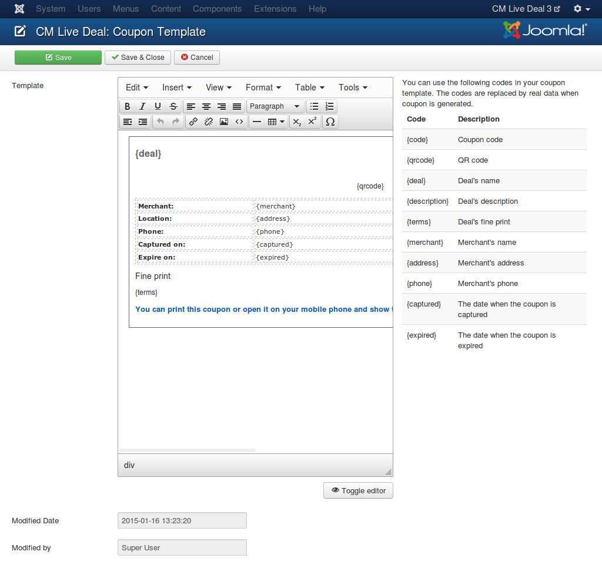

===============
Coupon template
===============

After capturing a deal, a coupon for the deal is available for user. User can print coupon or show it on his/her phone to merchant.

To design how coupon on your site looks like, go to Components -> CM Live Deal.

.. image:: ../images/com_cmlivedeal_menu.jpg

On the toolbar, you click "Coupon template".

.. image:: ../images/com_cmlivedeal_dashboard.jpg

In the form, you can use HTML and CSS to design your coupon.

To display the information of deal on your coupon, you can use the following tags (shortcodes):

* **{code}**: Coupon code.
* **{deal}**: Deal's name.
* **{description}**: Deal's description.
* **{terms}**: Deal's fine print.
* **{merchant}**: Merchant's name.
* **{address}**: Merchant's address.
* **{phone}**: Merchant's phone.
* **{captured}**: Date when the coupon is captured.
* **{expired}**: Date when the coupon is expired.

When coupon is showed to user, the tags are replaced by deal's information.