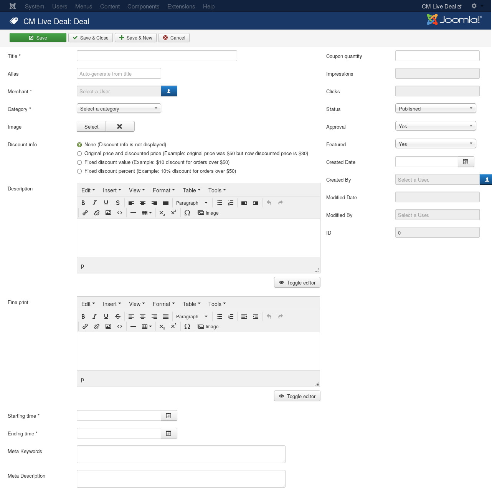
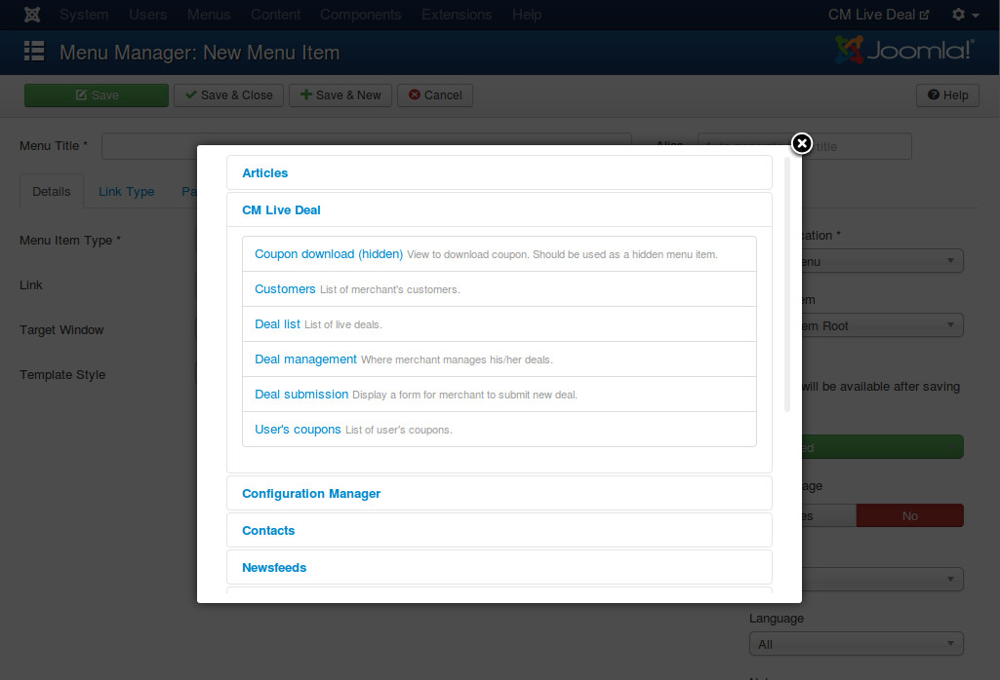
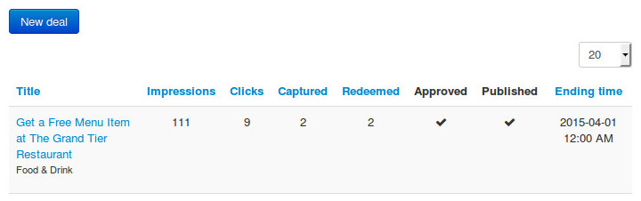
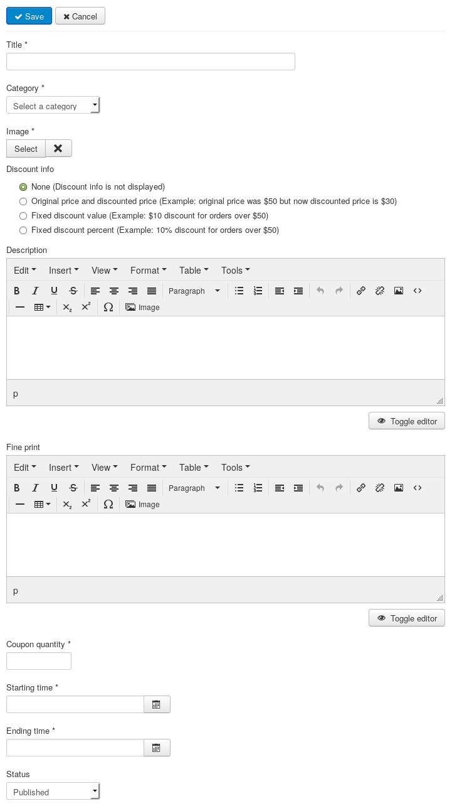
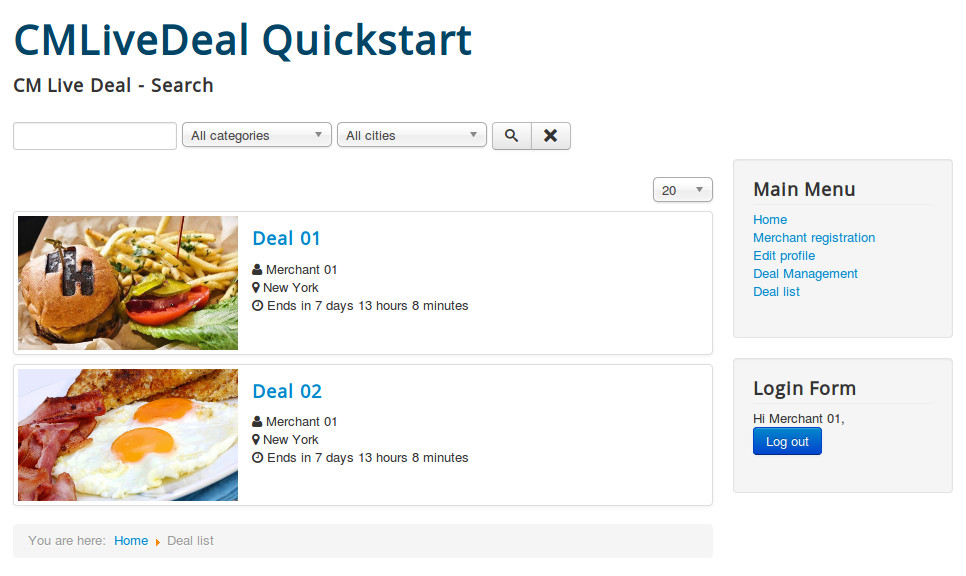

=====
Deals
=====

Create new deal in back-end
---------------------------

To create a new deal in your Joomla!'s back-end as an administrator, you go to Components -> CM Live Deal to access CM Live Deal component.

.. image:: ../images/com_cmlivedeal_menu.jpg

On the toolbar, you click "Deals" item to access the list of deals.

.. image:: ../images/com_cmlivedeal_dashboard.jpg

Click "New" button on the toolbar to create a new deal.

The form to create/edit deal looks like the screenshot below.

You need to enter your deal's details: name, description, fine print, starting date and ending date. You also need to select a merchant and a category for your deal.

To assign an image to your deal, you click "Select" button to open image popup. Before selecting/uploading a new image, you must select a merchant first, this merchant will be the owner of any image you upload while you are creating/modifying the deal, unless you select a different merchant. You can only assign 1 image to a deal.

If you want to publish the deal, you need to set "Status" to "Published" and "Approval" to "Yes". However the deal is visible to users or not also depends on starting and ending time.

"Approval" is for marking that if administrator has already reviewed and approved the deal which is submitted by merchant in front-end. When deal is approved, merchant can't change deal details any more, he/she only can modify starting and ending date.

Other fields in the form:

* **Impressions**: The number of times this deal is displayed in deal list.
* **Clicks**: The number of times users click this deal to view its detail.
* **Created Date**: The date the deal is created.
* **Created by**: The person who creates the deal.
* **Modified Date**: The date the deal is modified the last time.
* **Modified by**: The person who does the last modification.
* **ID**: The ID of the deal.

After saving the deal, it is displayed in your deal list.

Create new deal in front-end
----------------------------

Merchant's deal list
^^^^^^^^^^^^^^^^^^^^

To allow merchants access the list of their deals, you need to create a new menu item for "Deal Management" page.

Create a new menu item, select CM Live Deal -> Deal Management as the menu item type.

In your front-end, login as a merchant and access the new menu item, you can see the list of merchant's deals.

The list has 6 columns:

* **Title**: Displays deal name and the name of the category which the deal is in.
* **Impressions**: How many times the deal is showed in deal list to users.
* **Clicks**: How many times users click the deal to view its details.
* **Captured**: How many coupons of the deal that users have captured.
* **Redeemed**: The number of redeemed coupons of the deal.
* **Approved**: The deal is approved by administrators or is still in review.

Click on deal name to edit the deal. If deal is already approved, merchant can only change starting and ending dates. If the deal is not approved yet, merchant still can modify the deal's details.

Submit new deal
^^^^^^^^^^^^^^^

In deal list, merchant can click "New deal" button to submit a new deal.

The form has the following fields:

* **Title**: The deal's name.
* **Category**: The category which the deal is in.
* **Image**: Merchant can click "Select" button to open a popup and select an uploaded image, merchant can also upload a new image.
* **Description**: The deal's description.
* **Fine print**: The deal's terms and conditions.
* **Starting time**: When the deal starts public to users.
* **Ending time**: When the deal expires and is not visible to users any more.

You will receive message "Item successfully submitted." if deal is saved successfully.

Deal Submission page
^^^^^^^^^^^^^^^^^^^^

Instead of accessing Deal Management page and click "New deal" button to create a new deal. You can also create a menu item for "Deal Submission" page and let merchants directly access and create new deal.

Deal list
---------

Deal list is where users browse and find the deals that they are interested in.

In your back-end, you create a new menu item for "Deal List" page. You can check the menu item in front-end, the deal list is similar to the below screenshot.

