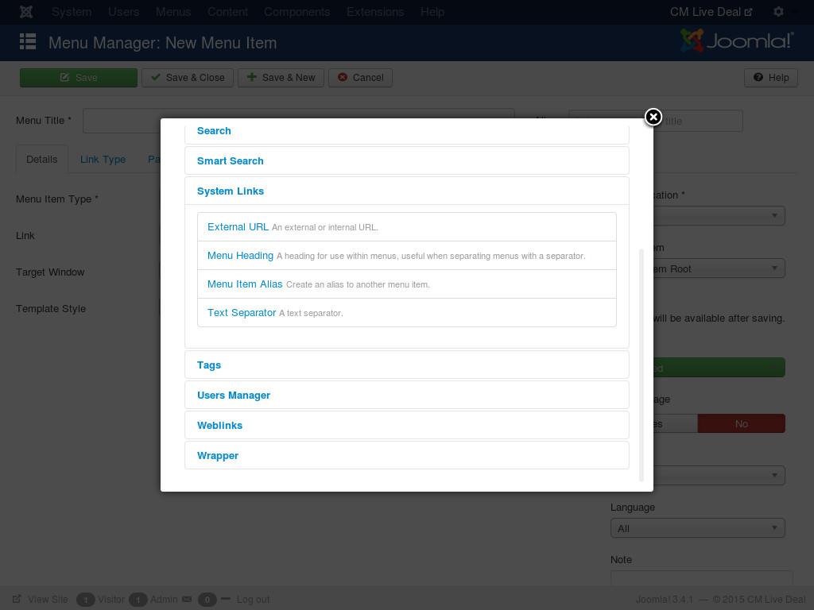

.. _ref-friendly_url:

======================================
Friendly URL for categories and cities
======================================

Before CM Live Deal 1.5.0, when you search for deals in city/category, you get an URL in this structure:

**\http://yoursite.com/deals?keyword=&category=X&city=Y**

X is the ID of the selected category, Y is the ID of the selected city.

Since 1.5.0, city's alias and category's alias are used to support friendly URL when searching for deals.

If you look for deals in Spa category, we can get an URL similar to this:

**\http://yoursite.com/deals/spa**

If you search for deals in New York, we have this URL:

**\http://yoursite.com/deals/new-york**

When searching for spa deals in New York, we get:

**\http://yoursite.com/deals/new-york/spa**

You can easily notice a possible conflict here, what if we have a category "spa" and a city "spa", the URL will be the same:

**\http://yoursite.com/deals/spa**

In this case, CM Live Deal will look for deals in city "spa" instead of category "spa". So to avoid this conflict, you should keep in mind that you shouldn't have a city and a category which have the same alias. To solve the conflict you need to edit the alias of city or category, for example changing "spa" to "spa-city" for city, or "spa" to "spa-deals" for category.

Menu items for categories and cities
------------------------------------

By using :ref:`ref-mod_cmlivedeal_categories` and :ref:`ref-mod_cmlivedeal_cities` you can have menus for categories and cities automatically.

But if you want to create menu items by yourself, for example to list only 5 categories or feature the category for Christmas deals etc..., you can use "External URL" menu item type,

Create a new menu item, you click "Select" button of "Menu Item Type" option, in the popup you select "External URL" in "System Links".

After the popup is closed, you enter the URL of the city/category (or both) into "Link" field. Now when user clicks this menu item in your front-end, he/she is taken to the page where the deals in defined city/category (or both) are displayed.