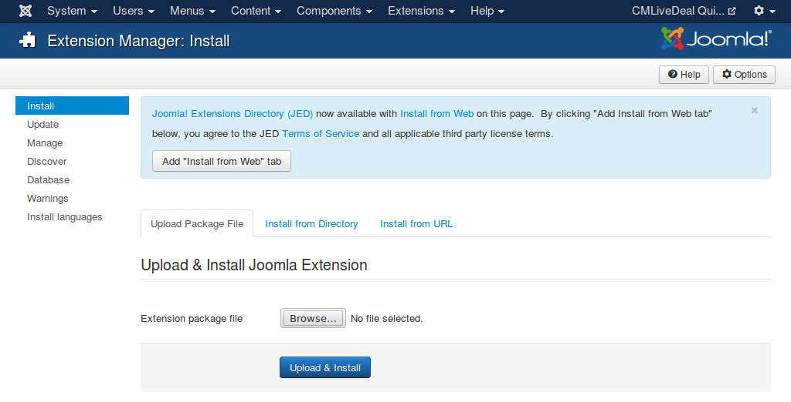
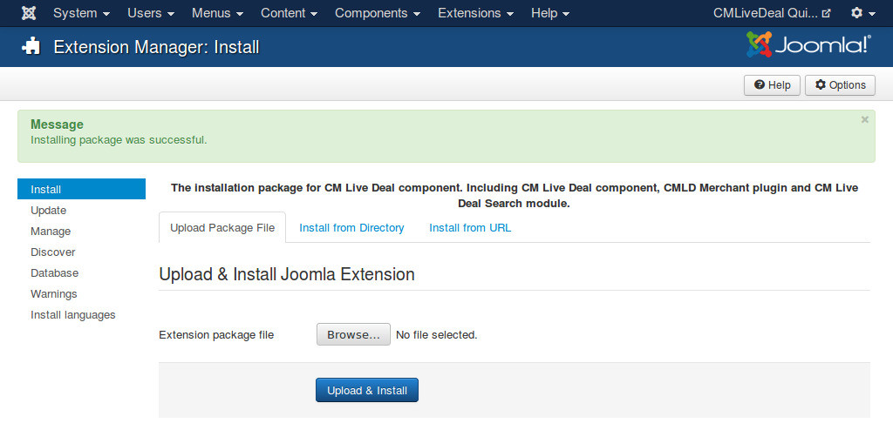

=================
Install & upgrade
=================

Install
-------

This section will show you how to install CM Live Deal on your Joomla! 3.x.x website.

We strongly recommend to backup your site before installing any new extension on your site.

Log into your Joomla! back-end. On the top menu, you navigate to Extensions -> Extension Manager to access Extension Manager.

.. image:: ../images/installation_menu.jpg

You see the page like the screenshot below.

Click "Browse" button and select the package of CM Live Deal that you downloaded from our website, click "Upload & Install" button to upload the package to your server to install.

If the installation is successful, you will receive the message "Installing package was successful."

Now the component CM Live Deal, its plugins and modules are installed on your site. You can now start using them.

If you want to support PDF coupon, you also need to install mPDF library package. You can view :ref:`ref-pdfcoupon` section for more information.

Upgrade
-------

To upgrade CM Live Deal, you just need to install the package of the new version.

If you upgrade from a version which is older than 1.2.0, you need to run "Deal alias generator" tool after upgrade. You can view :ref:`ref-tools` section for more information.

If you upgrade from a version which is older than 1.5.0, you need to run "City alias generator" tool after upgrade. You can view :ref:`ref-tools` section for more information.