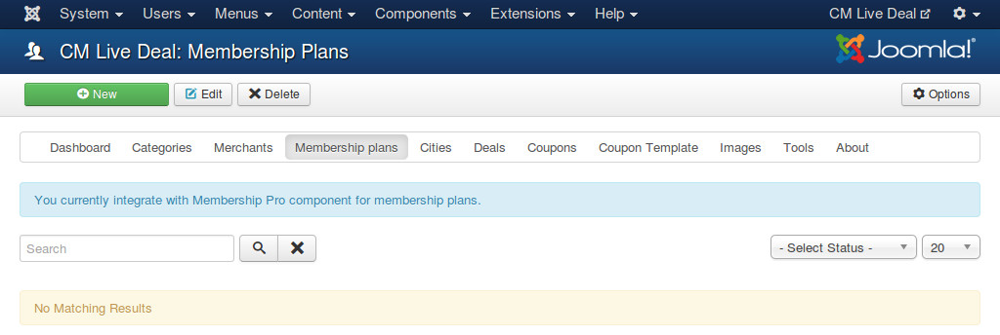
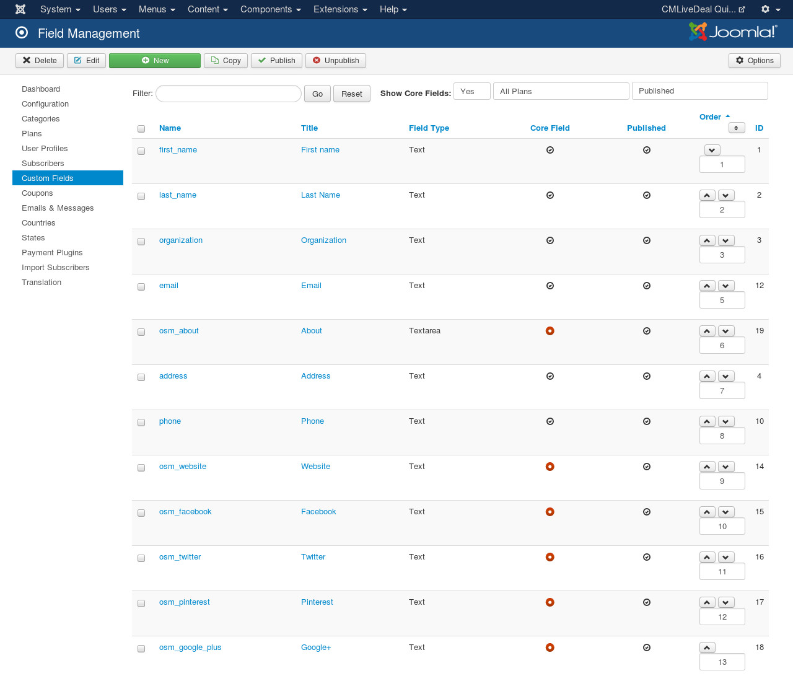
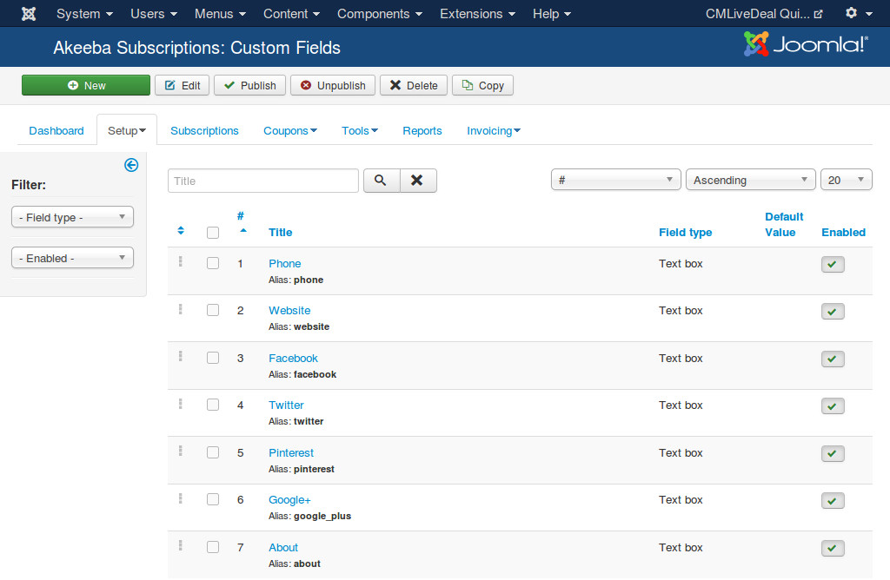
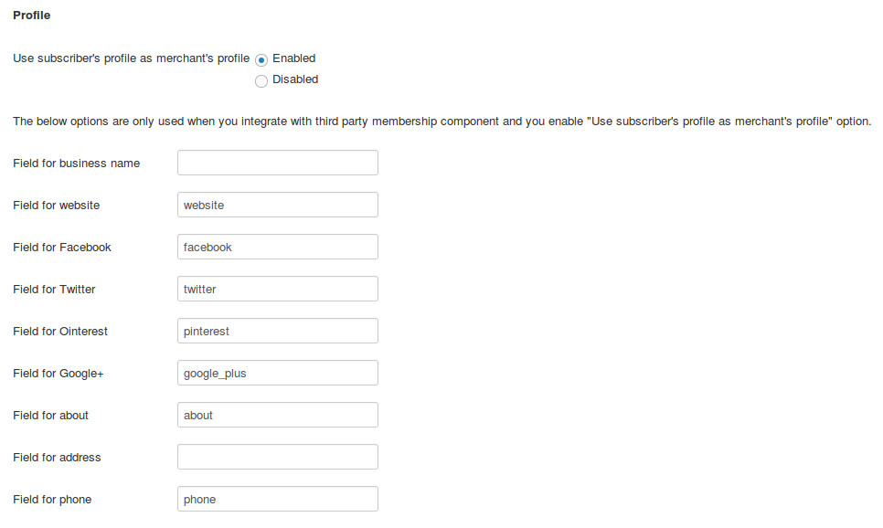

.. _ref-membership:

======================
Membership integration
======================

Overview
--------

When you integrate with a third party membership Joomla! component, you can

* earn money when merchant subscribes a new membership plan or upgrades subscribed plans
* limit how many deals merchant can create
* limit how may days merchant's deals are displayed on your site

When the limitations are reached, if merchant wants to create more deals or extend the expired dates of merchant's deals, merchant needs to upgrade to a higher membership plan.

Configuration
-------------

You can enable this integration in :ref:`Configuration <ref-configuration-merchant>`. At the present time CMLiveDeal has integrations with `Membership Pro <http://extensions.joomla.org/extensions/e-commerce/membership-a-subscriptions/20725>`_ and `Akeeba Subscription <https://www.akeebabackup.com/>`_ components. More membership components will be integrated in future.

After enabling the integration by selecting a membership. Membership Plans item is displayed in the component's menu.

Plugins
-------

If you integrate with Membership Pro component, you will need to enable "Membership Pro - CM Live Deal integration" plugin which is automatically installed when you install CM Live Deal package. There is no configuration needed for this plugin.

Integration
-----------

If the membership component that you select in the configuration is not installed yet, you will get an empty page when access Membership Plans page.

If the component is already installed, you will get the list of membership plans.

After creating the plans in the membership component, you go back to CM Live Deal's Membership Plans to create the plans to connect CM Live Deal and the membership component, click "New" button on the toolbar to create a new plan.

* **Plan name**: The name of the membership plan. Used internally in CM Live Deal only, only visible to administrators.
* **Integrated plan**: The membership plan of the integrated membership component.
* **Deal quantity**: The maximum deal quantity that merhant is allowed to created. You can enter -1 for unlimited quantity.
* **Length**: The number of days that merchant's deals are published on the site.
* **Created date**: When the plan is created.
* **Created by**: The user who creates the plan.
* **Modified date**: The user who does the last modification.
* **Modified by**: When the last modification is maded.
* **ID**: Record number in the database.

If in the future you switch to a different membership component, you need to edit each of your plans, select the new membership component's plan in "Integrated plan" option, otherwise the integration will be broken.

Create deal
-----------

If the deal quantity of merchant's subscribed plan is unlimited (-1 value), then merchant can create unlimited deals on your site.

If it is limited by a specific value and merchant's deal quantity is smaller than this value, in merchant's deal management page there is a message similar to this:

However if merchant's deal quantity is equal to the limit value, New button is not displayed any more and merchant is asked to upgrade his/her membership:

In the above screenshot, by clicking "ugrade" link, merchant is taken to the menu item to upgrade the membership plan. You can select this menu item in the component's configuration.

Deal's length
-------------

When merchant submits a new deal, administrator will review and approve the deal. The deal's starting date is only counted by the time when administrator approves the deal, not by the time merchant submits the deal.

For example, if merchant submits a deal at January 01, 2015 01:00:00, 12 hours later administrator approves the deal, then the deal's starting date is January 01, 2015 13:00:00. If the deal's length is 1 day then it will be unpublished at January 02, 2015 13:00:00.

Merchant profile
----------------

When merchant subscribes for his/her membership, the membership component asks merchant for basic information in the subscription form, you can get this information and put into merchant's profile.

If merchant renews his/her membership, the data in CMLiveDeal profile will not be modified unless it is empty, for example if merchant deletes the phone number in CMLiveDeal profile, he/she provides the phone number when renews the membership, then this new phone number will be automatically updated in CMLiveDeal profile and it will be displayed in the deals of this merchant.

Below is the instruction for setting this up in membership components.

Membership Pro
^^^^^^^^^^^^^^

In Custom Fields section, you edit/create your fields. The first column "Name" contains the required information you need to put into CMLiveDeal's configuration.

Go to "Merchant" tab in CMLiveDeal's configuration, set "Use subscriber's profile as merchant's profile" to "Enabled", enter the field name you have in the column "Name" in Membership Pro's Custom Fields section into the fields at the bottom of the page.

.. image:: ../images/com_cmlivedeal_membership_profile.jpg

Akeeba Subscription
^^^^^^^^^^^^^^^^^^^

In Akeeba Subscription's Custom Fields, you create the custom fields for website, Facebook, Twitter, Pinterest, Google+, phone and merchant's about info. CMLiveDeal automatically takes Akeeba Subscription's business name and address so you don't need to create fields for merchant's name and address.

Go to "Merchant" tab in CMLiveDeal's configuration, set "Use subscriber's profile as merchant's profile" to "Enabled". You enter the aliases (slugs) of the custom fields you create in Akeeba Subscription's Custom Fields, you don't need to enter values for "Field for business name" and "Field for address" fields.

