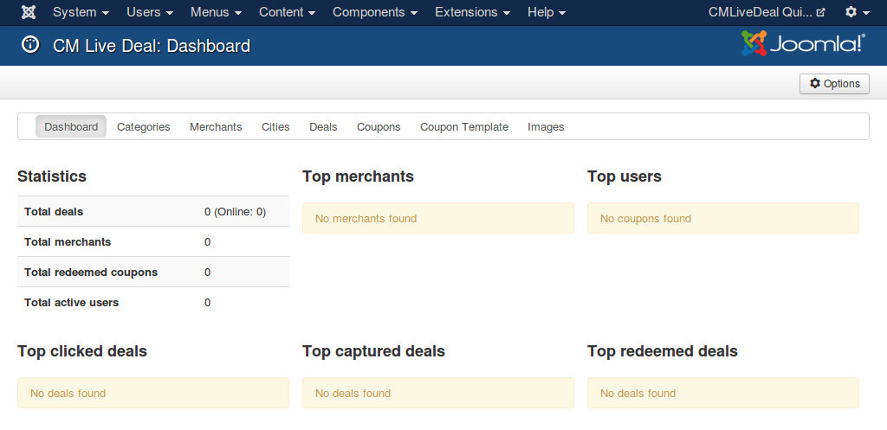

=========
Merchants
=========

This section will give you instructions to register a new merchant in front-end and manually create a new merchant in back-end.

This section uses the result of the setup in :ref:`ref-configuration` section.

New merchant registration
-------------------------

Access your menu item for merchant registration that you create in :ref:`Configuration <ref-merchant-registration-menu-item>` section, fill the form and click the Register button.

If in CM Live Deal's Configuration, you set

* "Merchant's user group" option to "Merchants" user group (create in :ref:`Configuration <ref-create-merchant-group>` section).
* "Add merchant to group" option to "Add automatically after registration".
* "Block merchant" to "No".

Then your new merchant is displayed in User -> User Manager similar to the screenshot below.

Create new merchant
-------------------

As an administrator, you can always create a new user account in back-end.

Access User -> User Manager, click "New" button to add a new user.

In "Account Details" tab, you provide basic account information for user.

In "Assigned User Groups", "Registered" group is selected by default, you need to select the group for your merchants. In the below screenshot, "Merchants" group that we create in :ref:`Configuration <ref-create-merchant-group>` section is selected.

In "Merchant Profile" tab, you enter the details of merchant's business.

After saving the new user, it is displayed in the list of users on the site.

Edit profile
------------

To allow users to edit their profiles, you need to create a menu item for "Edit User Profile"

Create a new menu item in a menu that you want, select User Manager -> Edit User Profile as the menu item type.

Access the new menu item in front-end, login with a merchant account, you can see the form to edit profile which includes merchant's profile fields.

As an administrator, you can always edit any user's profile in User Manager.

Administrator can add and edit meta description and meta keywords for merchant, merchant can't do this by himself in front-end. Meta description and meta keywords are used in merchant's detail page for SEO purpose.

Manage merchants
----------------

In your back-end, go to Components -> CM Live Deal to access CM Live Deal component.

.. image:: ../images/com_cmlivedeal_menu.jpg

On the toolbar, you click "Merchants" item to access the merchant map. 

With this Google Maps, you can see the cities and the merchants in every city. Every city has a circle, if the merchant is in the circle of a city that means the merchant's deals can be listed in the deal list when users search for deals in that city.

If there is any merchant that is not in the circle of any city, you should create a new city for that merchant, or extend the radius of the nearest city, otherwise the deals of these merchants are not searchable.

