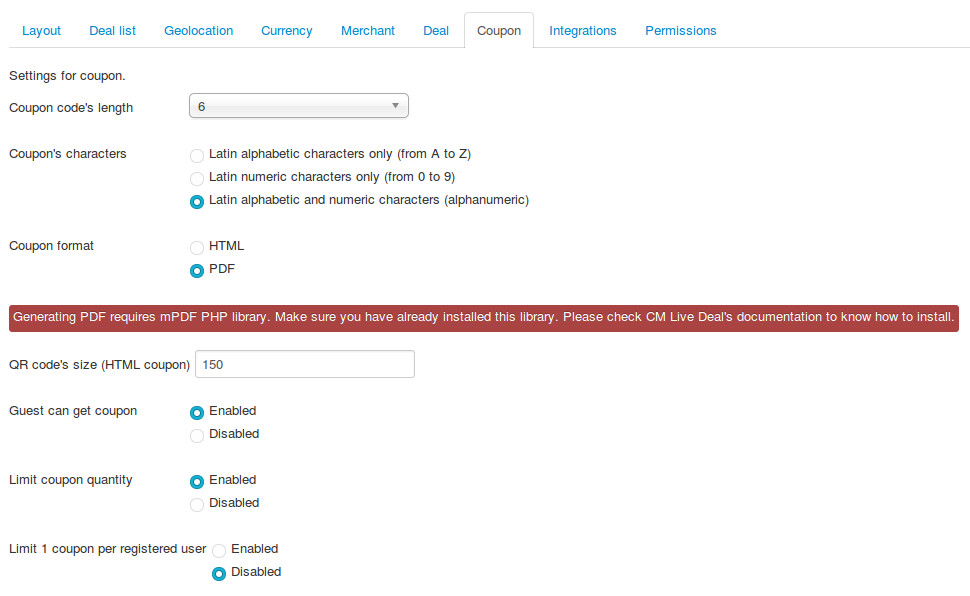
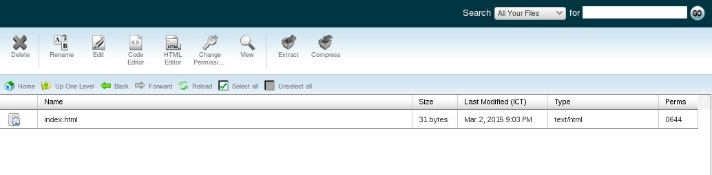
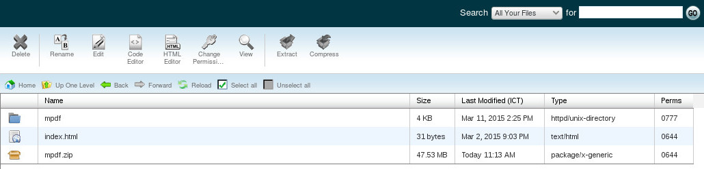
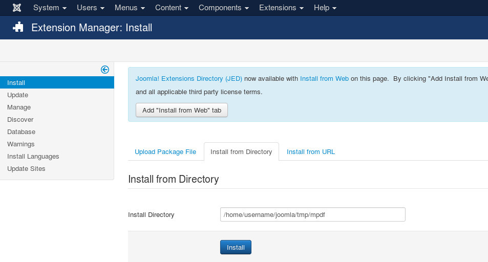

.. _ref-pdfcoupon:

==========
PDF coupon
==========

Before CM Live Deal 1.5.0, coupon was only in HTML format. Since 1.5.0, you can configure to use HTML coupon or PDF coupon in the component's configuration.

Download mPDF library
---------------------

You can download mPDF Joomla! library at `http://cmext.vn/download/mpdf-joomla-library <http://cmext.vn/download/mpdf-joomla-library>`_.

Install mPDF library
--------------------

Because the package is about 47MB, so if your server allows to upload more than 47MB you can install this package via Extension Manager just like installing any other Joomla! extension. However if you can't install by using "Upload Package File" option, you can use "Install from Directory" option. The following instruction is for installing via "Install from Directory" option.

First you need to log into your hosting's control panel, access file manager tool, go the "tmp" folder in your Joomla! root folder, the below screenshots are the file manager of CPanel which is popular and is used by many hosting providers.

You upload the mPDF package into this "tmp" folder. In the below screenshots, the package is named "mpdf.zip".

.. image:: ../images/mpdf_uploaded.jpg

You can use any ZIP extracting tool available in the file manager to extract the filer. In CPanel, you select the file and click "Extract" button on the toolbar. The result is "mpdf" folder.

In Joomla!'s Extension Manager, you switch to "Install from Directory" tab and enter the path the "mpdf" folder. If your "tmp" folder is "/home/username/joomla/tmp" then the path to "mpdf" folder should be "/home/username/joomla/tmp/mpdf".

Click "Install" button the library will be installed, you will get the successful message in the next page.

.. image:: ../images/mpdf_success.jpg

Now mPDF library is installed, you can delete "mpdf.zip" file and "mpdf" folder in your "tmp" folder.