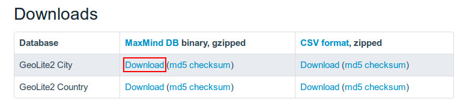
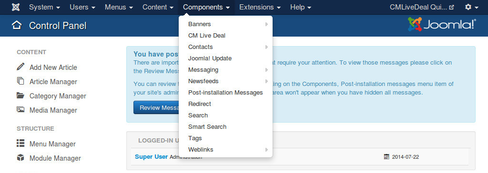
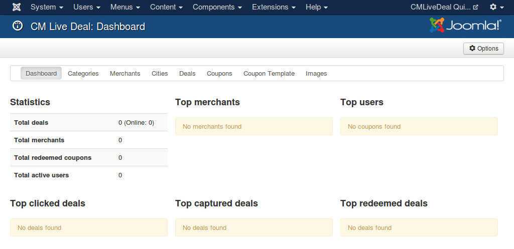
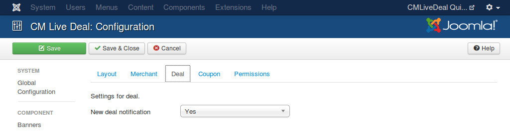

.. _ref-search:

=======================
Search for nearby deals
=======================

By using CM Live Deal Search module, user can search for deals in all cities, in a specific city or deals near user.

You can check :ref:`ref-mod_cmlivedeal_search` section to know how to setup the search  module.

To detect user's location, CM Live Deal uses GeoLite2 data created by MaxMind, available from `http://www.maxmind.com <http://www.maxmind.com>`_.

Get GeoLite2 City database
--------------------------

GeoLite2 City is required to detect user's location. Because the database file's size is big, we don't include it in CM Live Deal's package, you need to download it from MaxMind website then upload it to your server manually.

Go to `http://dev.maxmind.com/geoip/geoip2/geolite2/ <http://dev.maxmind.com/geoip/geoip2/geolite2/>`_, download the gzipped binary file of GeoLite2 City.

Use your favorite file compression software to uncompress the downloaded file, then you get the file GeoLite2-City.mmdb, upload this file to <Joomla! root folder>/administrator/components/com_cmlivedeal/helpers/geoip/database/ folder.

Configure CM Live Deal component
--------------------------------

In your Joomla! back-end you go to Components -> CM Live Deal.

On the toolbar, you click "Options" button.

Go to "Deal" tab and set the radius (in kilometer) to search for nearby deals from user's location and the cookie lifetime.

* **Search radius from user's location**: The radius in kilometer to search for nearby deals of user. Default is 5 kilometers. This value is used when user searches for deals in his/her location by using the search module.
* **Location cookie's lifetime**: Detect user's location requires reading the database file and make the server slow. User's location can be stored in cookie and reused later to reduce file reads from server. With this option you can set how many days this cookie is available. Default value is 7 (days). You can disable storing cookie by using 0 value.

Search in front-end
-------------------

Go to your front-end where the search module is displayed. Now if you select "Your location" in the city list and search, you will get the deals near you in the result.

If the database file doesn't exist, this function doesn't work.

If your location can not be detected (not in MaxMind's database), you will see the error message "We can't detect your current location.".