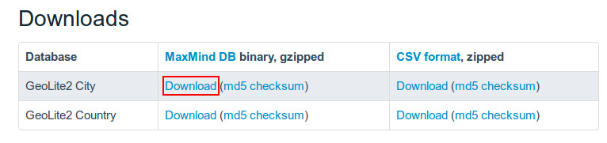

.. _ref-mod_cmlivedeal_search:

==========================
CM Live Deal Search module
==========================

To configure your Search module, you go to Extensions -> Module Manager.

.. image:: ../images/module_menu.jpg

Joomla! creates a new module for you automatically after you install the package of CM Live Deal. You can see CM Live Deal - Search module in your module list.

.. image:: ../images/module_list.jpg

Click on the module name to edit its settings. You can give the module a new name by modifying "Title" field. In the "Module" tab, you set "Status" to "Published" and select the position you want to put this module in "Position" option.

In "Options" tab, you can configure the main settings of the module.

.. image:: ../images/mod_cmlivedeal_search_tab_options.jpg

* **Display**: How search form is displayed, there are 3 styles, "Inline", "Horizontal", "Vertical". You can see how search form looks like in these styles in the screenshot below.
* **Keyword field's CSS**: Custom CSS classes for keyword input field.
* **Category list's CSS**: Custom CSS classes for category dropdown list.
* **City list's CSS**: Custom CSS classes for city dropdown list.
* **Search button's CSS**: Custom CSS classes for search button.
* **Clear button's CSS**: Custom CSS classes for clear button.
* **Display Clear button**: Display or hide clear button.
* **Button's label**:

  * *Use icon*: Use only icons for search and clear buttons.
  * *Use text*: Use only text for search and clear buttons.
  * *Use icon and text*: Use both icon and text for search and clear buttons.

CSS fields are useful if you want to customize the element of search form to match your template's style. This requires your skills in HTML and CSS.

In "Menu Assignment" tab, you configure what pages the module is displayed on.

.. image:: ../images/mod_cmlivedeal_search_menu_assignment.jpg

After adjusting the settings, you can save the module and then you will receive "Module successfully saved" message. If you change the module's name, you can see its name is updated in the module list.

.. image:: ../images/mod_cmlivedeal_search_saved.jpg

You can check on your front-end to see if the module is displayed properly. The below screenshot is how the inline search form is displayed in "banner" positon of Joomla!'s' default Protostar template.

**Examples** (the settings on the left side, the result on the right side)

Example of how inline search form is displayed. The Clear button is displayed and the buttons have only icons. The fields are customized by using "input-medium" class of Bootstrap.

Example of how horizontal search form is displayed. The Clear button is not displayed and the Search button has only text. The fields are customized by using "input-medium" class of Bootstrap.

.. image:: ../images/mod_cmlivedeal_search_horizontal.jpg

Example of how vertical search form is displayed. The Clear button is displayed and is customized by "btn-warning" class of Boostrap. The Search button is customized by "btn-success" class of Bootstrap. Icon and text are both used in the buttons. The fields are customized by using "input-medium" class of Bootstrap.

.. image:: ../images/mod_cmlivedeal_search_vertical.jpg

Search for nearby deals
-----------------------

By using CM Live Deal Search module, user can search for deals in all cities, in a specific city or deals near user.

To detect user's location, You can use GeoLite2 data created by MaxMind, available from `http://www.maxmind.com <http://www.maxmind.com>`_, or use HTML5 Geolocation service.

MaxMind service works on server side so it works in all browsers. HTML5 Geolocation works on client side, and not all browsers support HTML5 Geolocation, so dectecting user's location is not possible if user's browsrs is not supported.

Get GeoLite2 City database
^^^^^^^^^^^^^^^^^^^^^^^^^^

GeoLite2 City is required to detect user's location. Because the database file's size is big, we don't include it in CM Live Deal's package, you need to download it from MaxMind website then upload it to your server manually.

Go to `http://dev.maxmind.com/geoip/geoip2/geolite2/ <http://dev.maxmind.com/geoip/geoip2/geolite2/>`_, download the gzipped binary file of GeoLite2 City.

Use your favorite file compression software to uncompress the downloaded file, then you get the file GeoLite2-City.mmdb, upload this file to <Joomla! root folder>/administrator/components/com_cmlivedeal/helpers/geoip/database/ folder.

Configure CM Live Deal component
^^^^^^^^^^^^^^^^^^^^^^^^^^^^^^^^

In your Joomla! back-end you go to Components -> CM Live Deal.

.. image:: ../images/com_cmlivedeal_menu.jpg

On the toolbar, you click "Options" button.

.. image:: ../images/com_cmlivedeal_dashboard.jpg

Go to "Deal" tab, you select the Geolocatin service, set the radius (in kilometer) to search for nearby deals from user's location

.. image:: ../images/com_cmlivedeal_geolocation.jpg

* **Geolocation service**: The service you use to detect user's location.
* **Search radius from user's location**: The radius in kilometer to search for nearby deals of user. Default is 5 kilometers. This value is used when user searches for deals in his/her location by using the search module.

Search in front-end
^^^^^^^^^^^^^^^^^^^

Go to your front-end where the search module is displayed. Now if you select "Your location" in the city list and search, you will get the deals near you in the result.

.. image:: ../images/search_dropdown.jpg

If the database file doesn't exist, this function doesn't work.

If your location can not be detected (not in MaxMind's database), you will see the error message "We can't detect your current location.".