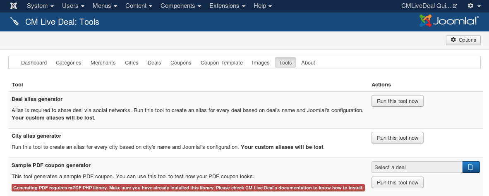

.. _ref-tools:

=====
Tools
=====

Tools is available since version 1.2.0. You can find it in the component's menu. Tools are used help you do some technical tasks easily without touching the source code or the database.

At the present time there is only 1 tool "Deal alias generator", more tools will be added in future. To run a tool, you just need to click it's "Run this tool now" button.

Deal alias generator
--------------------

Before version 1.2.0, there was no sharing feature. Since 1.2.0 we can share deals to social networks. To be able to share deals, we need to have deal alias. This tool help you create deal alias automatically based on deal title.

If you upgrade from a version older than 1.2.0, you need to run this tool at least once to generate aliases for your existing deals.
