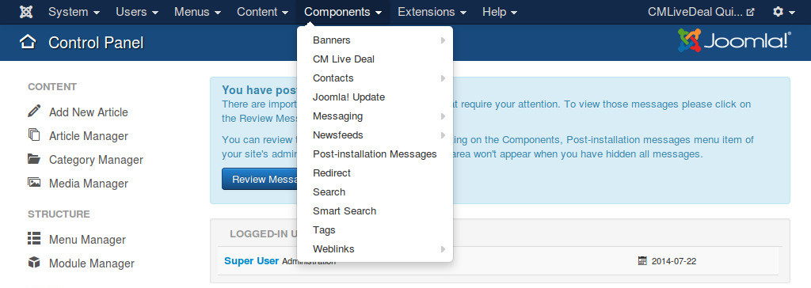

===============
User statistics
===============

User statistics help merchant know if a customer is a serious customer and if he/she already came to merchant in the past.

User statistics
---------------

This information of a user has 2 values:

* How many coupons the user captured (1)
* How many coupons the user came to merchant and redeemed (2)

If (2) value is equal to (1) value, this means the user always comes to redeem the coupons that he/she captures on the site. This is a serious customer, if he/she is happy at the merchant's place, there are many chances that he/she will come back.

If (1) value is much greater than (2) value, the merchant shouldn't expect that the user will come to the merchant to redeem the current coupon.

Captured and Redeemed values are not available if the owner of the coupon is a guest.

User visits
-----------

If the owner of coupon is a return customer, this means the customer enjoyed the products or the services of merchant and now he/she comes back again.

Configuration
-------------

To enable the statistics, in your Joomla! back-end you go to Components -> CM Live Deal.

On the toolbar there is a button "Options", you click this button to configure the component.

.. image:: ../images/com_cmlivedeal_dashboard.jpg

Switch to "Merchant" tab and set "Display user's stats" and "Display user's stats" options to "Yes".

In your Joomla! front-end, go to the menu item of Customers view, you can see that the statistics are displayed in the coupon list, the descriptions for these statistics are also displayed to help merchants understand.

